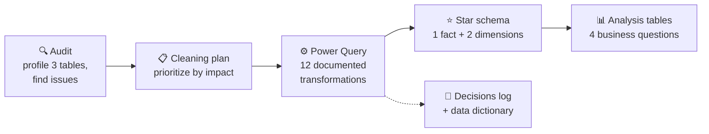
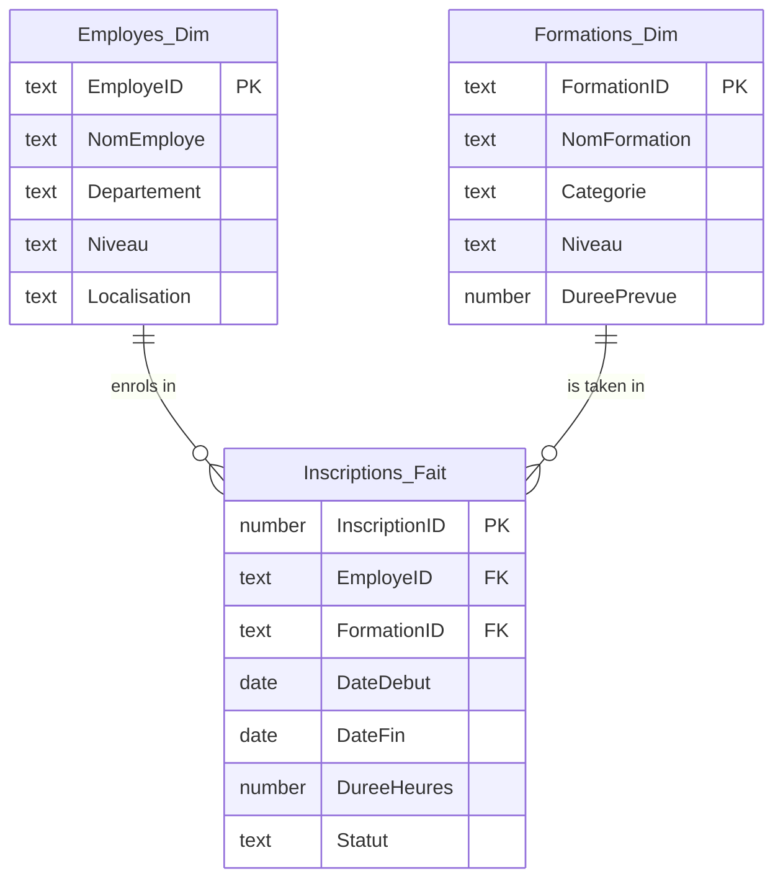

# Employee Training Data — Quality Audit, Cleaning & Power BI Star Schema

**Before analyzing data, make sure you can trust it.**

This project takes a messy 3-table HR dataset (employee training enrolments for 2024) through a full **data quality workflow**: audit, prioritized cleaning plan, Power Query transformations, a **star schema in Power BI**, and complete documentation (decisions log and data dictionary).

`Power BI` · `Power Query` · `Data modeling` · `Data quality` · `Data documentation`

---

## The workflow



## Issues found and how they were fixed

| # | Issue | Quality dimension | Impact | Fix |
|---|---|---|---|---|
| 1 | Exact duplicate enrolment row | Accuracy | Double-counted enrolments | Removed the duplicate |
| 2 | Same department written 2 ways ("Info" / "Informatique", "Finances" / "Finance") | Consistency | Fragmented categories, wrong totals | Standardized the values |
| 3 | Status variants ("Complete", "completé") | Consistency | Wrong status counts | Standardized to "Complété" |
| 4 | Start date **after** end date | Validity | Invalid durations | Validated date columns with swap logic |
| 5 | Missing training duration | Completeness | Duration can't be analyzed | Recalculated from the corrected dates |
| 6 | Training ID `F10` ("Cloud") used in enrolments but missing from the Trainings table | Referential integrity | Orphan foreign key | Added F10 to the Trainings dimension |
| 7 | Training name column missing from the Trainings table | Completeness | Incomplete dimension | Retrieved it through a join |
| 8 | Headers not promoted in the Employees table | Structure | Columns misread | Promoted headers and set data types |
| 9 | Rows lost when joining Trainings and Enrolments | Completeness | Enrolments excluded | Switched to a **right outer join** to keep every enrolment |

The full reasoning for each step (priority, justification, order) is in [`docs/`](docs/).

## Data model

The cleaned data is organized as a **star schema** so it can be analyzed reliably in Power BI:



On top of the model, four analysis tables answer the business questions:
- Which **department** uses the training platform the most?
- What is the **average training duration** in hours?
- Which **day of the week** is the busiest?
- Which **type of training** is the most popular?

## Repository structure

```
├── powerbi/training_data_model.pbix     # Power Query steps + star schema + analysis tables
└── docs/
    ├── README.md                        # full documentation (French): audit, plan, transformations, decisions, dictionary
    └── original-word/                   # the 5 original deliverables (.docx)
```

Open the `.pbix` file with [Power BI Desktop](https://www.microsoft.com/power-platform/products/power-bi/desktop) (free) to see every Power Query step.

## Context

Final project for **DECI1021 – Data Cleaning and Preparation**, Data Analytics program, CCNB Bathurst (Winter 2026). Individual project by **Sanaba Kanté**.

---

<details>
<summary><b>🇫🇷 Résumé en français</b></summary>

Projet final du cours DECI1021 (Nettoyage et préparation des données). À partir d'un jeu de données RH de 3 tables (inscriptions aux formations en 2024), j'ai réalisé toute la démarche qualité :

1. **Audit de données** : 9 problèmes détectés (doublon, valeurs incohérentes, dates invalides, clé étrangère orpheline, colonnes manquantes).
2. **Plan de nettoyage** priorisé selon l'impact.
3. **12 transformations Power Query** documentées.
4. **Modèle en étoile** dans Power BI (1 table de faits, 2 dimensions) et 4 tables d'analyse.
5. **Documentation** : journal des problèmes et décisions, catalogue et dictionnaire de données.

La documentation complète est dans [`docs/`](docs/).
</details>
